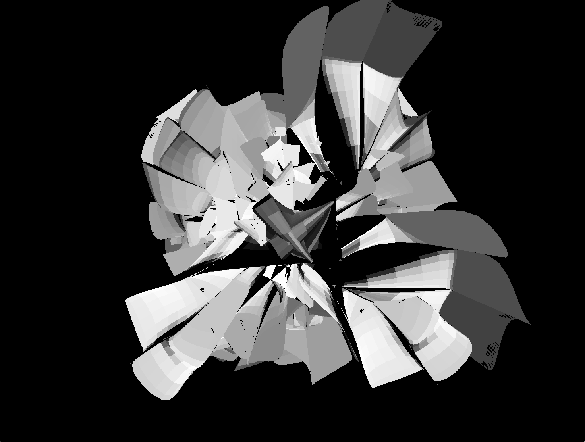
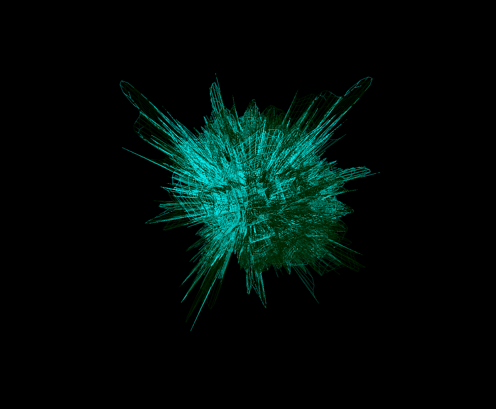
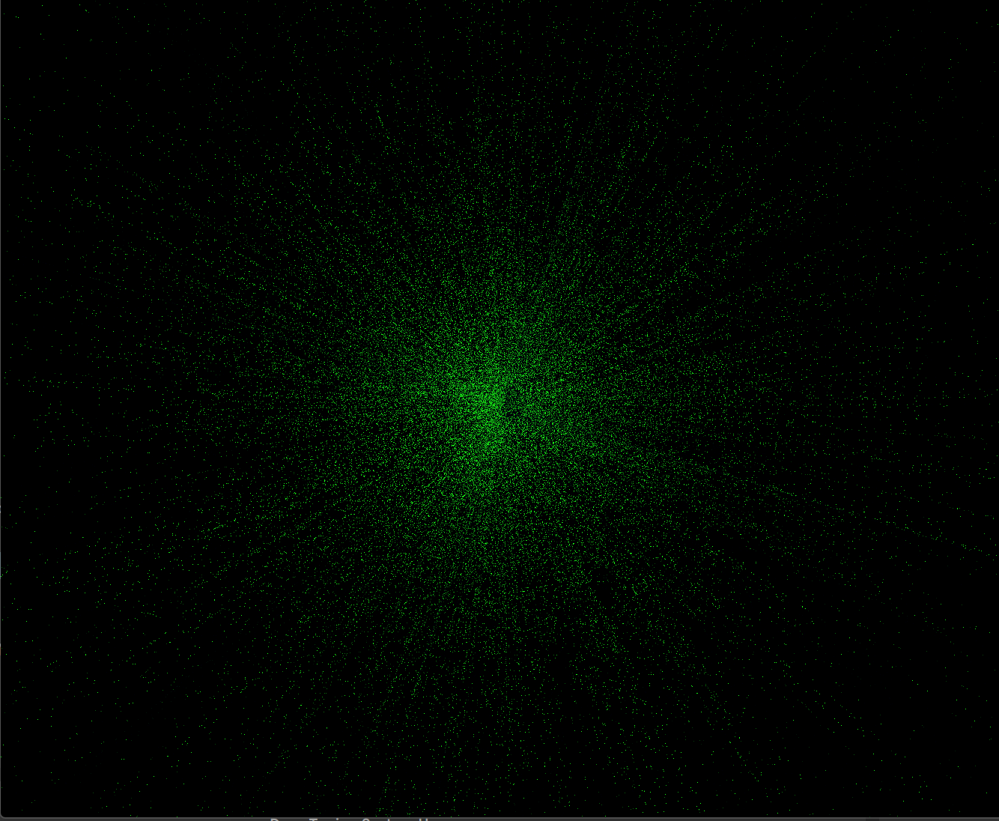
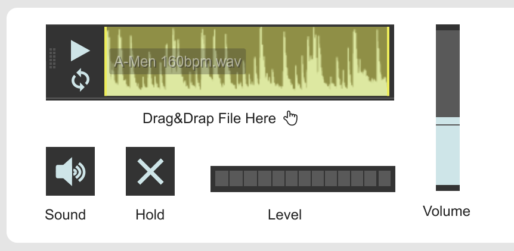
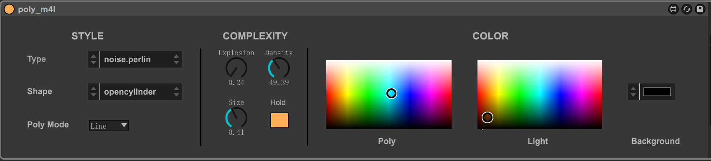

# POLY_MSP

A simple audio reactive polygon visual generator in Max MSP

## Features

- Real-time reactive to audio volume
- Various parameters to mess with
- Supports M4L

## Usage

### 1. Max Patch

Drag&Drop audio to playback. Hold to stop rendering. Be mindful with volume level.

### 2. Ableton

Drag&Drop to tracks as audio effects. Only one device can be used in every live set.

## Parameters

- use STYLE to set the basic shape. Try different noise generating algorithm to shape the polygon.

- use COMPLEXITY dials to bend the effects of audio response
- use other devices to modulate the COLOR when VJing